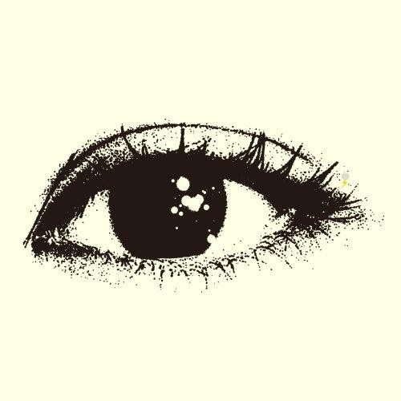
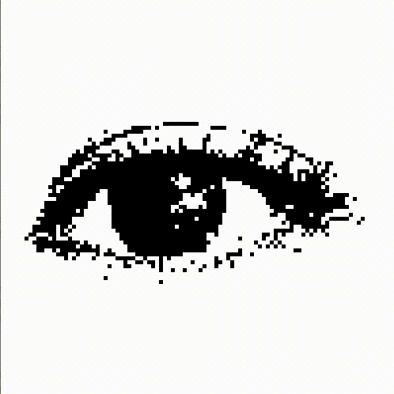
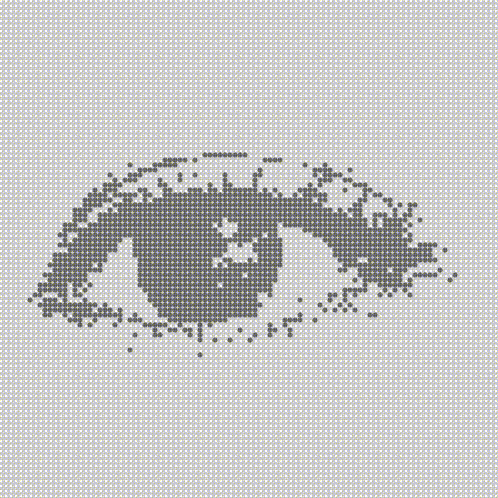

#Image to Game of Life

A processing sketch that takes an image as input and uses it as the first generation for Conway's Game of Life. Click to start the game of life, and click to pause. Remember, when using a different image the size() function has to be updated accordingly. Here is it in action.

Source image:

The Game of Life running:

Some pretty interesting effects can be produced by tweaking the drawing methods.
For instance, this is what happens when changing the cell shape to circle, changing the opacity to low
and the dead cell size to half of a normal cell.

##Notes

* Works best on images that are naturally high contrast.
* If an image comes out too dark or too light, try using different thresholds.
* The large amount of pixels dissapearing is due to overpopulation